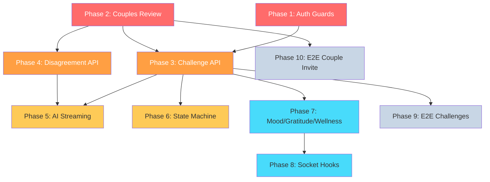

# Test Coverage Improvement Plan

Based on [TEST_COVERAGE_ANALYSIS.md](file:///Users/sebicas/Documents/Antigravity/Kuxani/.agent/TEST_COVERAGE_ANALYSIS.md). The codebase has strong DB integration and pure-logic unit tests but **zero API-layer coverage** across 39 routes.

---

## Phase 1 — API Auth Guards (Unit, Mocked Session)

**Goal:** Verify every route returns `401` when unauthenticated.

#### [NEW] [api-auth-guards.test.ts](file:///Users/sebicas/Documents/Antigravity/Kuxani/tests/api-auth-guards.test.ts)

A single file that loops through **all 39 route handlers**, calling each exported function (`GET`, `POST`, `PUT`, `DELETE`) with a mocked `getServerSession` returning `null`, asserting `401`.

**Pattern:** Follow [health.test.ts](file:///Users/sebicas/Documents/Antigravity/Kuxani/tests/health.test.ts) — `vi.mock("@/lib/auth/session")` + dynamic import each route.

| Detail    | Value               |
| --------- | ------------------- |
| Type      | Unit (mocked)       |
| Config    | `vitest.config.ts`  |
| Est. size | ~200 lines          |
| Run       | `npm run test:unit` |

---

## Phase 2 — Couples CRUD + Invite/Join (Integration)

**Goal:** Test the foundational couple lifecycle at the HTTP level.

> [!NOTE]
> `partner-invitation.test.integration.ts` already covers this flow extensively. This phase reviews it for completeness and adds any missing edge cases.

#### [MODIFY] [partner-invitation.test.integration.ts](file:///Users/sebicas/Documents/Antigravity/Kuxani/tests/partner-invitation.test.integration.ts)

Add missing cases if any:

- Invite code uniqueness (`POST /api/couples` twice → different codes)
- `GET /api/couples` response shape validation
- Couple status transitions (`pending` → `active`)

| Detail | Value                          |
| ------ | ------------------------------ |
| Type   | Integration (live DB + HTTP)   |
| Config | `vitest.integration.config.ts` |
| Run    | `npm run test:integration`     |

---

## Phase 3 — Challenge API Routes (Integration)

**Goal:** Test the full challenge lifecycle through HTTP handlers including auth, validation, perspectives visibility, acceptance logic, and status transitions.

#### [NEW] [challenges-api.test.integration.ts](file:///Users/sebicas/Documents/Antigravity/Kuxani/tests/challenges-api.test.integration.ts)

**Tests:**

1. `POST /api/challenges` — creates challenge + auto-creates perspectives, returns `201`
2. `POST /api/challenges` — returns `400` with empty/missing title
3. `PUT /api/challenges/[id]/perspectives` — submit perspective, verify partner's is hidden
4. `PUT /api/challenges/[id]/perspectives` — after both submit, both visible
5. `POST /api/challenges/[id]/accept` — single-partner accept (partial), both-partner accept (resolves)
6. `GET /api/challenges` — only returns couple's challenges, not another couple's
7. Status must be `created` → `perspectives` → `synthesis` → `accepted` (no skipping)

**Pattern:** Follow `partner-invitation.test.integration.ts` — spin up Next.js, authenticate two users, make HTTP requests with session cookies.

| Detail    | Value                          |
| --------- | ------------------------------ |
| Type      | Integration (live DB + HTTP)   |
| Config    | `vitest.integration.config.ts` |
| Est. size | ~400 lines                     |
| Run       | `npm run test:integration`     |

---

## Phase 4 — Disagreement API Routes (Integration)

**Goal:** Test disagreement lifecycle, message exchange, visibility rules, and status transitions.

#### [NEW] [disagreements-api.test.integration.ts](file:///Users/sebicas/Documents/Antigravity/Kuxani/tests/disagreements-api.test.integration.ts)

**Tests:**

1. `POST /api/disagreements` — create disagreement, returns `201`
2. `POST /api/disagreements/[id]/invite` — invite partner
3. `POST /api/disagreements/[id]/join` — partner joins
4. `POST /api/disagreements/[id]/messages` — send messages, verify visibility rules (`creator_only` / `partner_only` / `all`)
5. `POST /api/disagreements/[id]/resolve` — resolve disagreement
6. Cross-couple isolation — User C can't access couple A-B's disagreements

| Detail    | Value                          |
| --------- | ------------------------------ |
| Type      | Integration (live DB + HTTP)   |
| Config    | `vitest.integration.config.ts` |
| Est. size | ~350 lines                     |
| Run       | `npm run test:integration`     |

---

## Phase 5 — AI Streaming Routes (Unit, Mocked OpenAI)

**Goal:** Test SSE response format, context assembly, error handling, and DB persistence after stream completion.

#### [NEW] [ai-streaming.test.ts](file:///Users/sebicas/Documents/Antigravity/Kuxani/tests/ai-streaming.test.ts)

**Tests:**

1. Synthesis route — returns SSE `data:` lines + `[DONE]` terminator
2. Synthesis route — saves result to DB after stream completes
3. Discussion route — includes correct context sections in prompt
4. Error handling — returns proper error response on OpenAI timeout/rate-limit
5. Status-based prompt selection in disagreement messages

**Pattern:** Mock `openai` module + mock DB. Verify the `ReadableStream` response content.

| Detail    | Value                     |
| --------- | ------------------------- |
| Type      | Unit (mocked OpenAI + DB) |
| Config    | `vitest.config.ts`        |
| Est. size | ~300 lines                |
| Run       | `npm run test:unit`       |

---

## Phase 6 — State Machine Transitions (Unit)

**Goal:** Validate that challenge and disagreement status transitions follow the allowed state graph and guard conditions are enforced.

#### [NEW] [state-transitions.test.ts](file:///Users/sebicas/Documents/Antigravity/Kuxani/tests/state-transitions.test.ts)

**Tests:**

1. Challenge — valid transitions: `created` → `perspectives` → `synthesis` → `accepted` → `discussing` → `resolved`
2. Challenge — invalid transitions rejected (e.g. `created` → `resolved`)
3. Challenge — synthesis requires both perspectives submitted
4. Disagreement — valid transitions through all 8 statuses
5. Disagreement — guard conditions (e.g. both partners must join before messages)

> [!IMPORTANT]
> If the state machine logic is currently inline in route handlers, this phase may require **extracting** transition validation into a shared module before writing tests.

| Detail    | Value               |
| --------- | ------------------- |
| Type      | Unit                |
| Config    | `vitest.config.ts`  |
| Est. size | ~200 lines          |
| Run       | `npm run test:unit` |

---

## Phase 7 — Mood / Gratitude / Wellness API Routes (Integration)

**Goal:** Test CRUD, partner visibility filtering, and validation for the wellness features.

#### [NEW] [mood-api.test.integration.ts](file:///Users/sebicas/Documents/Antigravity/Kuxani/tests/mood-api.test.integration.ts)

**Tests:**

1. `POST /api/mood` — create entry with valid data, returns `201`
2. `POST /api/mood` — returns `400` with missing `primaryEmotion`
3. `GET /api/mood` — returns own + partner's shared entries only
4. `GET /api/mood` — does NOT return partner's unshared entries
5. `GET /api/mood?days=7` — filters by date range

#### [NEW] [gratitude-api.test.integration.ts](file:///Users/sebicas/Documents/Antigravity/Kuxani/tests/gratitude-api.test.integration.ts)

**Tests:**

1. `POST /api/gratitude` — create entry, returns `201`
2. `GET /api/gratitude` — returns entries for current month
3. Prompt generation — `GET /api/gratitude/prompts`

#### [NEW] [wellness-api.test.integration.ts](file:///Users/sebicas/Documents/Antigravity/Kuxani/tests/wellness-api.test.integration.ts)

**Tests:**

1. `POST/GET /api/childhood-wounds` — CRUD + AI suggest
2. `POST/GET /api/love-languages` — quiz submission + retrieval
3. `POST/GET /api/attachment-styles` — quiz submission + retrieval
4. `POST/GET /api/deescalation` — session CRUD + prompts

| Detail    | Value                          |
| --------- | ------------------------------ |
| Type      | Integration (live DB + HTTP)   |
| Config    | `vitest.integration.config.ts` |
| Est. size | ~600 lines (3 files)           |
| Run       | `npm run test:integration`     |

---

## Phase 8 — React Socket.IO Hooks (Unit, RTL)

**Goal:** Test the 6 Socket.IO hooks for correct event subscriptions, cleanup, and state updates.

> [!WARNING]
> This phase requires adding `@testing-library/react` and `jsdom` as dev dependencies.

#### [NEW] [socket-hooks.test.ts](file:///Users/sebicas/Documents/Antigravity/Kuxani/tests/socket-hooks.test.ts)

**Tests (per hook):**

1. Subscribes to correct Socket.IO event on mount
2. Unsubscribes on unmount (no memory leaks)
3. Updates local state when event fires
4. Handles reconnection gracefully

| Detail    | Value                                                      |
| --------- | ---------------------------------------------------------- |
| Type      | Unit (RTL + mocked socket)                                 |
| Config    | `vitest.config.ts` (needs `environment: 'jsdom'` override) |
| Est. size | ~250 lines                                                 |
| New deps  | `@testing-library/react`, `@testing-library/jest-dom`      |
| Run       | `npm run test:unit`                                        |

---

## Phase 9 — E2E Challenge Lifecycle (Playwright)

**Goal:** Test the full user-facing challenge flow end-to-end.

#### [NEW] [challenges.spec.ts](file:///Users/sebicas/Documents/Antigravity/Kuxani/e2e/challenges.spec.ts)

**Flow:**

1. User A logs in → creates challenge
2. User A writes & submits perspective
3. User B logs in → writes & submits perspective
4. Both perspectives visible → AI synthesis triggered
5. Both partners accept synthesis
6. Discussion phase → resolution

| Detail    | Value              |
| --------- | ------------------ |
| Type      | E2E (Playwright)   |
| Est. size | ~150 lines         |
| Run       | `npm run test:e2e` |

---

## Phase 10 — E2E Couple Invite/Join (Playwright)

**Goal:** Test the user-facing couple creation and partner invitation flow.

#### [NEW] [couple-invite.spec.ts](file:///Users/sebicas/Documents/Antigravity/Kuxani/e2e/couple-invite.spec.ts)

**Flow:**

1. User A signs up → lands on dashboard → creates couple
2. Invite link displayed with code
3. User B signs up → navigates to invite link → joins
4. Both users see partner info on dashboard

| Detail    | Value              |
| --------- | ------------------ |
| Type      | E2E (Playwright)   |
| Est. size | ~100 lines         |
| Run       | `npm run test:e2e` |

---

## Execution Order & Dependencies



> 🔴 Critical → 🟠 High → 🟡 High → 🔵 Medium → ⚪ Medium

---

## Verification Plan

### After Each Phase

```bash
# Unit tests
npm run test:unit

# Integration tests
npm run test:integration

# E2E tests (phases 9-10)
npm run test:e2e

# Full suite
npm test
```

### Final Validation

```bash
# Run full test suite to confirm no regressions
npm test

# Build to ensure no type errors
npm run build
```
